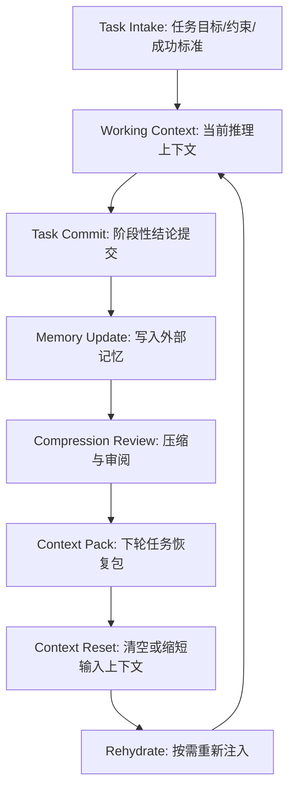

# OpenO1 上下文生命周期与外部记忆设计 v0.1

## 1. 定位

本文件记录 OpenO1 在长任务、多轮推理、多 Agent 协作中的上下文生命周期设计。

核心目标是把短对话式上下文改造成可沉淀、可恢复、可审阅、可回滚的推理状态系统。数学推理可以作为第一阶段验证场景，但本设计应适用于代码推理、研究分析、规划、科学假设验证和复杂写作等更一般任务。

## 2. 核心原则

- 先功能闭环，后性能优化。
- 外部记忆必须服务于任务恢复、证据追踪、状态压缩和长期协作，不能只作为普通聊天记录堆叠。
- 模型已经接收的输入上下文不能被原地修改；OpenO1 应通过任务边界、外部记忆和重新注入的 `Context Pack` 实现“可编辑上下文”的工程效果。
- 缓存命中率和 token 成本是优化目标，不能成为正确性依赖。
- 每次压缩、清空、重建上下文前，必须保留可审计的摘要、关键证据、未决问题和回滚点。
- 任何压缩结果都不能把假设、猜测、局部验证结果写成已证明事实。

## 3. 上下文生命周期



### 3.1 Task Intake

任务开始时，中心引擎应生成 `TaskSpec`，至少包含：

- 用户目标。
- 已知约束。
- 成功标准。
- 必须保留的输入材料。
- 可选参考材料。
- 风险等级。
- 预算上限。

### 3.2 Working Context

Working Context 是模型当前可见的上下文窗口，只承载完成当前阶段任务所需的信息。它不应该无限继承全部历史。

### 3.3 Task Commit

当一个阶段完成后，中心引擎应要求当前 Agent 提交结构化结果：

```ts
type TaskCommit = {
  task_id: string
  phase_id: string
  completed_claims: ClaimRecord[]
  evidence: Evidence[]
  assumptions: string[]
  open_questions: string[]
  blockers: Blocker[]
  recommended_next_steps: string[]
}
```

### 3.4 Memory Update

外部记忆写入应区分四类内容：

| 类型 | 含义 | 是否可直接恢复进上下文 |
| --- | --- | --- |
| `fact` | 已验证事实或用户明确给出的稳定偏好 | 可以 |
| `claim` | 当前任务内得到的结论 | 需带验证状态 |
| `hypothesis` | 推理假设或待实验判断 | 必须标注未验证 |
| `artifact_ref` | 文件、代码、图表、日志、提交记录等外部产物引用 | 按需注入 |

### 3.5 Compression Review

压缩不是单纯缩写，而是一次质量审查。压缩结果必须保留：

- 当前任务的目标和边界。
- 已完成结论及其验证状态。
- 关键证据的位置或引用。
- 仍未解决的问题。
- 下一步最小可执行动作。
- 可能导致失败的风险和阻断项。

### 3.6 Context Pack

`Context Pack` 是下一轮任务重新注入模型的最小恢复包。

```ts
type ContextPack = {
  task_summary: string
  current_state: string
  verified_claims: ClaimRecord[]
  unresolved_claims: ClaimRecord[]
  required_artifacts: ArtifactRef[]
  user_preferences: string[]
  next_action: string
  rollback_point?: string
}
```

### 3.7 Context Reset 与 Rehydrate

当上下文过长、任务阶段完成、模型开始重复、或 ReviewGate 判断当前上下文污染风险升高时，可以触发 Context Reset。

Reset 后不得直接丢失任务状态。下一轮只能通过经过审阅的 `Context Pack`、必要原文片段、关键文件引用和外部记忆检索结果恢复任务。

## 4. 缓存与成本策略

缓存命中率会受到上下文变动影响。OpenO1 的第一版实现不应把缓存命中当成主要约束。

优先级建议：

1. 跑通任务闭环：能提交、能验证、能恢复、能回滚。
2. 保证状态质量：压缩结果不丢关键证据，不制造伪事实。
3. 再优化成本：减少无效历史注入，提高可复用片段稳定性。
4. 最后优化缓存：让系统提示词、协议、固定模板尽量稳定，把频繁变化的任务材料隔离到后部上下文。

## 5. 与多 Agent 协议的关系

多 Agent 协议负责“谁做、谁审、谁修、何时停止”。上下文生命周期负责“状态如何保存、压缩、恢复和回滚”。

二者必须共享同一个中心状态源：

- `Coordinator` 负责触发 Task Commit、Memory Update、Context Pack 生成。
- `Verifier` 和 `ReviewGate` 负责检查压缩结果是否保留关键证据与风险。
- `Synthesizer` 只能使用通过 ReviewGate 的状态生成最终输出。
- `BudgetManager` 负责在上下文长度、token、时间和工具调用之间做预算控制。

## 6. 最小可行实现建议

第一版只需要实现最小闭环：

1. 每个任务阶段结束时生成 `TaskCommit`。
2. 把 `TaskCommit` 追加写入外部记忆或项目日志。
3. 生成一个可读的 `Context Pack`。
4. 新阶段开始时只注入 `Context Pack`、必要证据和当前任务材料。
5. ReviewGate 检查是否存在关键事实丢失、假设被误写成事实、下一步动作不清晰等问题。

暂时不强求复杂向量检索、最优 token 压缩或缓存最大化。只有当最小闭环稳定后，再引入 embedding Top-K、记忆分层、自动摘要评分和缓存友好的上下文模板。