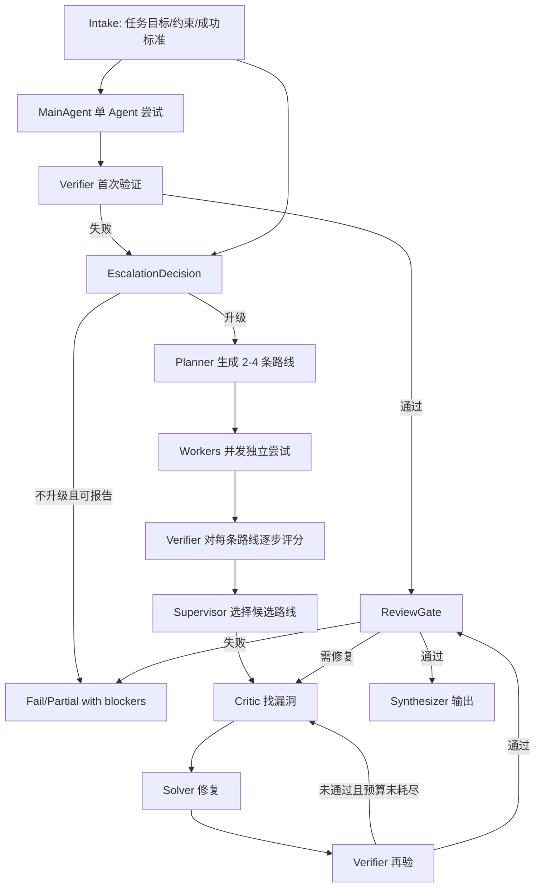

# OpenO1 多 Agent 调度协议 v0.1

## 1. 定位

OpenO1 的多 Agent 系统不是自由群聊，而是通用推理受控状态机。数学推理只是第一阶段验证场景；核心协议必须适用于代码推理、研究分析、规划、科学假设验证等更一般任务。

核心原则：

- 中心引擎是唯一状态所有者。
- Agent 只能提交结构化中间结果，不能直接改写任务目标、共享最终结论或最终答案。
- 所有结论必须带来源、证据、假设、风险和验证状态。
- 所有验证失败、预算耗尽、冲突未解时，必须报告阻断原因，不能合成伪成功答案。

## 2. 角色分工

| 角色 | 职责 | 禁止事项 |
| --- | --- | --- |
| `Coordinator` | 管理状态机、分派任务、归并结果、决定是否升级多 Agent | 不直接跳过验证输出最终答案 |
| `MainAgent` | 默认单 Agent 起步，完成初判、首轮解法和首轮自检 | 不在验证失败后继续单线程硬扛 |
| `Planner` | 生成 2-4 条候选路线，定义路线标题、目标和步骤 | 不生成无可验证步骤的空泛路线 |
| `Worker` | 按指定 `route_id` 和 `step_id` 独立尝试 | 不跨路线、不改题目、不写最终答案 |
| `Verifier` | 逐步验证路线，给出评分、阻断项和证据 | 不只给“看起来对”的结论 |
| `Supervisor` | 比较路线，选择候选路线或要求修复/降级失败 | 不只按总分选有高危阻断的路线 |
| `Critic` | 找漏洞、反例、缺失假设、边界问题 | 不负责修复，不直接否定无证据路线 |
| `Solver` | 根据 Critic/Verifier 的阻断项修复指定路线 | 不扩大任务范围 |
| `Synthesizer` | 在 Review Gate 放行后合成最终输出 | 不引入未验证的新结论 |
| `ReviewGate` | 最终质量门禁，决定 `pass` / `repair` / `fail` | 不被 Worker 或 Synthesizer 绕过 |
| `BudgetManager` | 控制 agent 数量、轮数、token、时间和无进展停止 | 不允许无限循环 |

## 3. 默认流程



## 4. 升级条件

默认单 Agent 起步。满足任一条件时升级到多 Agent：

- `complexity_score >= 3`
- 首次验证失败
- MainAgent 置信度低于阈值
- 存在多条明显候选路线
- 任务包含高风险推理：长链证明、多情况分类、跨文档结论、重要决策建议、代码架构变更
- Verifier 发现高危阻断项：目标不一致、关键步骤不可证、假设缺失、边界遗漏、证据不足
- 同一路线修复超过 1 次仍无明显提升

复杂度初判建议：

| 分数 | 含义 | 默认调度 |
| --- | --- | --- |
| 1 | 单步或低风险问答 | MainAgent + Verifier |
| 2 | 有少量推理或工具检查 | MainAgent + Verifier，失败后升级 |
| 3 | 中等复杂、多步骤或有边界条件 | 直接 Planner + 多 Worker |
| 4 | 多路线、高风险、需独立审查 | 多 Worker + Critic + ReviewGate |
| 5 | 影响 benchmark/交付/重要结论 | 多路线并发 + 双重验证 + 失败可追踪 |

## 5. Shared Context

Shared Context 是中心引擎维护的追加式状态，不是 Agent 共享草稿。

```ts
type SharedContext = {
  task: TaskSpec
  routes: Record<RouteId, RoutePlan>
  claims: Record<ClaimId, ClaimRecord>
  messages: AgentEvent[]
  verification: Record<RouteId, VerificationResult[]>
  critiques: CritiqueRecord[]
  selectedRouteId?: RouteId
  blockers: Blocker[]
  budget: BudgetState
  reviewGate?: ReviewGateDecision
}
```

所有写入必须通过中心引擎校验：

- `route_id` 必须存在。
- `step_id` 必须属于该路线。
- `claim` 必须带证据和假设。
- `verified` 状态只能由 Verifier 或 ReviewGate 写入。
- `final_answer` 只能由 Synthesizer 在 ReviewGate 放行后生成。

## 6. 消息协议

Agent 输出必须是结构化事件。

```ts
type AgentEvent =
  | {
      type: "route_proposal"
      route_id: string
      title: string
      goal: string
      steps: RouteStep[]
      risk: "low" | "medium" | "high"
    }
  | {
      type: "step_result"
      route_id: string
      step_id: string
      claim: string
      evidence: Evidence[]
      assumptions: string[]
      confidence: number
    }
  | {
      type: "verification_result"
      route_id: string
      score: RouteScore
      blockers: Blocker[]
      passed: boolean
    }
  | {
      type: "critique"
      route_id: string
      target_step_id?: string
      issue: string
      severity: "low" | "medium" | "high"
      suggested_repair?: string
    }
  | {
      type: "repair_result"
      route_id: string
      repaired_steps: string[]
      changed_claims: string[]
      remaining_risks: string[]
    }
```

普通自然语言可以作为 `evidence.note` 或 `summary`，但不能替代结构化字段。

## 7. 路线评分

Verifier 对每条路线逐项评分，范围 `0-10`：

```ts
type RouteScore = {
  goal_alignment: number
  title_consistency: number
  step_validity: number
  assumption_safety: number
  evidence_quality: number
  edge_case_coverage: number
  completeness: number
  repairability: number
  overall: number
}
```

硬门槛：

- 任一高危 `blocker` 未解决，路线不能被选为最终路线。
- `goal_alignment < 8`，路线不能通过 ReviewGate。
- `title_consistency < 7`，必须重命名路线或修正结论表达。
- `step_validity < 8`，必须进入修复或失败。
- 所有证据缺失时，不能给 `passed: true`。

## 8. 路线标题与结论一致性

路线标题不是装饰，是约束。

检查项：

- 标题描述的路线方法是否与实际步骤一致。
- 最终结论是否回答原始目标。
- 结论中的变量、对象、范围是否与 TaskSpec 一致。
- Synthesizer 是否引入了未在路线中验证的新主张。
- 是否把假设、猜测、局部验证写成已证明事实。

不一致时处理：

1. 如果只是标题不准，重命名路线。
2. 如果结论偏离路线，退回 Solver 修复。
3. 如果结论偏离任务目标，路线失败。

## 9. 并发调度

并发只允许发生在依赖关系明确的边界。

可并发：

- 多条候选路线独立求解。
- 同一路线不同独立子目标。
- 对已完成路线的独立 Verifier / Critic 审查。
- 不共享写入目标的研究任务。

不可并发：

- 多个 Solver 同时修改同一条路线的同一 `step_id`。
- Verifier 在 Worker 尚未提交完整步骤前给最终通过。
- Synthesizer 在 ReviewGate 未放行前输出最终答案。
- 子 Agent 自行创建新的 AgentTeam。

## 10. 继续旧 Agent 还是新建 Agent

| 场景 | 调度选择 |
| --- | --- |
| 同一路线修复具体阻断项 | 继续原 Solver |
| 对实现者路线做独立验证 | 新建 Verifier |
| 原 Worker 探索范围很宽，下一步很窄 | 新建 Worker |
| 原路线方向错了 | 停止旧 Worker，新建 Worker |
| Worker 刚产生失败日志，需要修复 | 继续原 Worker |
| Critic 需要新视角找漏洞 | 新建 Critic |

继续旧 Agent 时，中心引擎必须把修复目标写清楚，不能只说“根据你的发现继续”。

## 11. 硬预算与停止条件

默认预算建议：

```ts
type AgentBudget = {
  max_routes: 4
  max_parallel_workers: 4
  max_total_agents: 8
  max_repair_rounds_per_route: 2
  max_verify_rounds_per_route: 3
  max_no_progress_rounds: 1
  max_route_steps: 8
}
```

停止条件：

- ReviewGate 通过。
- 所有路线都有不可修复高危阻断项。
- 修复轮数耗尽。
- 连续一轮无分数提升或阻断项减少。
- Agent 数量、轮数、token 或时间预算耗尽。
- 用户中断或目标变更。

停止时输出必须包含：

- 已尝试路线。
- 每条路线的最高评分。
- 未解决阻断项。
- 已验证内容与未验证内容边界。
- 是否建议继续、重启路线或调整任务定义。

## 12. Review Gate

ReviewGate 只接受三种决定：

```ts
type ReviewGateDecision =
  | { status: "pass"; selected_route_id: string; reasons: string[] }
  | { status: "repair"; route_id: string; blockers: Blocker[] }
  | { status: "fail"; blockers: Blocker[]; attempted_routes: string[] }
```

放行条件：

- 目标已达成。
- 无未处理高危阻断项。
- 关键步骤均有证据。
- 标题、路线、结论一致。
- 输出格式满足 TaskSpec。
- DomainVerifier 没有阻断项。

## 13. Domain Verifier

核心状态机保持通用，领域验证器作为插件接入。

```ts
type DomainVerifier = {
  domain: string
  canHandle(task: TaskSpec): boolean
  verifyRoute(route: RoutePlan, context: SharedContext): VerificationResult
  verifyFinal(output: FinalDraft, context: SharedContext): ReviewGateDecision
}
```

第一阶段实现 `MathDomainVerifier`：

- 变量定义一致性。
- 代数/逻辑步骤检查。
- 定义域、边界值、特殊值检查。
- AIME / MATH / GSM8K 格式检查。

后续可扩展：

- `CodeReasoningVerifier`
- `ResearchVerifier`
- `PlanningVerifier`
- `ScientificHypothesisVerifier`

## 14. 第一阶段实现边界

v0.1 先实现协议与状态机，不急于接真实模型：

1. 定义类型和状态转换。
2. 用 mock Agent 验证升级、并发、评分、修复、停止条件。
3. 接入一个本地 LLM adapter。
4. 接入 MathDomainVerifier。
5. 再做 benchmark/eval。

非目标：

- 不做无约束 Agent 群聊。
- 不让 Agent 直接共享可变最终答案。
- 不通过关闭验证、吞异常、放宽门槛制造成功。
- 不先引入复杂分布式执行；单进程状态机足够验证 v0.1。
